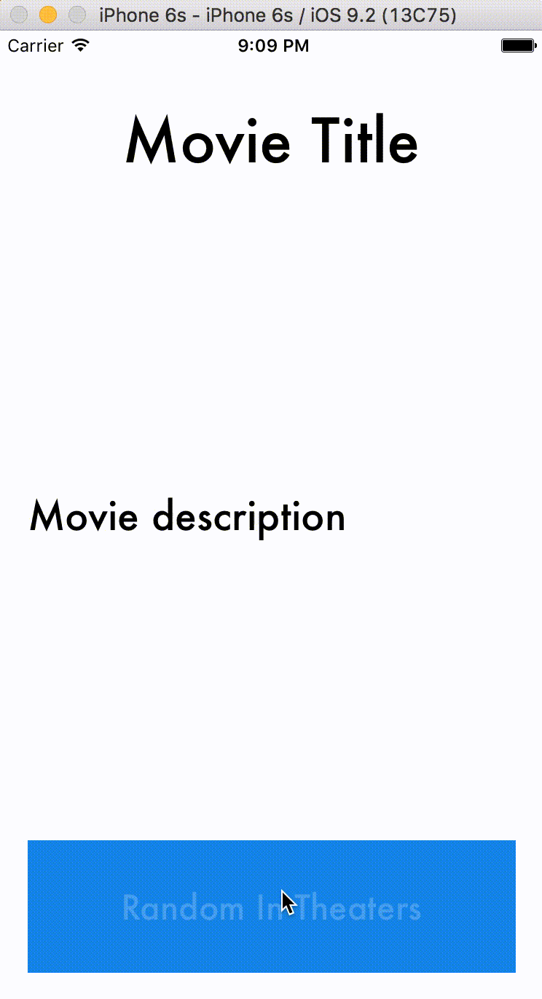

# Random Movie Alamofire
A simple iOS application that uses Alamofire to send GET HTTP requests to themovedb API for the current movies in theaters. Generates a random movie in theaters when the user clicks the button.

## Example

